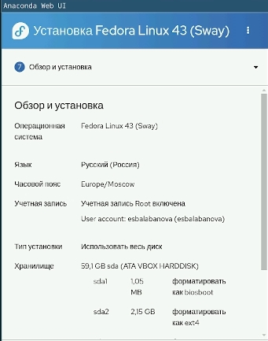
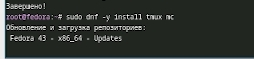
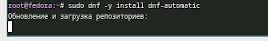
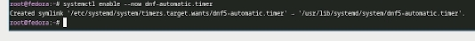
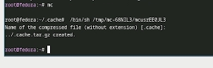
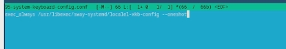
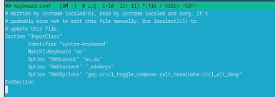
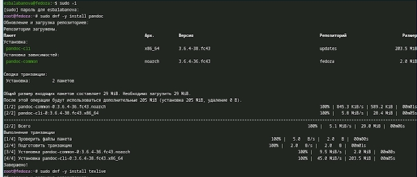

---
## Front matter
lang: ru-RU
title: Отчет по лабораторной работе №1
subtitle: Архитектура компьютера и операционные системы
author:
  - Балабанова Елизавета Сергеевна
institute:
  - Российский университет дружбы народов, Москва, Россия

## i18n babel
babel-lang: russian
babel-otherlangs: english

## Formatting pdf
toc: false
toc-title: Содержание
slide_level: 2
aspectratio: 169
section-titles: true
theme: metropolis
header-includes:
 - \metroset{progressbar=frametitle,sectionpage=progressbar,numbering=fraction}
---

# Информация

## Докладчик

  * Балабанова Елизавета Сергеевна
  * Группа: НКАбд-01-25
  * Студенчский билет: 1032253516
  * Российский университет дружбы народов

## Цели и задачи

Приобретение практических навыков установки операционной системы на виртуальную машину, настройки минимально необходимых для дальнейшей работы сервисов.

## Задание

1. Установка Linux на VirtualBox. 
2. Установка необходимого ПО. 
3. Первоначальная настройка ОС для дальнейшей работы.

---

##  Теоретическое введение

Операционная система Linux представляет собой семейство Unix-подобных операционных систем, основанных на одноименном ядре. Главной особенностью Linux является его открытый исходный код, что означает возможность свободного использования, изучения, изменения и распространения системы. Linux работает по принципу многозадачности и многопользовательского режима, обеспечивая высокую стабильность, безопасность и производительность. На основе ядра Linux создаются дистрибутивы – готовые к использованию операционные системы, включающие ядро, системные утилиты, графическую среду и прикладное программное обеспечение. 

##  Создание виртуальной машины

Установим виртуальную машину в VirtualBox. Создадим учебную запись и запустим установку.  (рис. 1).

{#fig-001 width=70%}

##

Войдем в супер-аккаунт для того, чтобы установить средства разработки (рис. 2).

{#fig-002 width=70%}

##

Обновим все пакеты  (рис. 3).

{#fig-003 width=70%}

##

Займемся повышением комфорта работы. Установим программы для удобства работы в консоли (рис. 4).

{#fig-004 width=70%}

##

Установим другой вариант консоли  (рис. 5).

{#fig-005 width=70%}

##

Подключим автоматическое обновление. Установим необходимое для этого программное обеспечение (рис. 6).

{#fig-006 width=70%}

##

Запустим таймер (рис. 7).

{#fig-007 width=70%} 

##

В данном курсе работа с SELinux не рассматривается, поэтому отключим её через mc (рис. 8).

{#fig-008 width=70%}

##

Займемся настройкой раскладки клавиатуры. Создадим конфигурационный файл (рис. 9).

{#fig-009 width=70%}

##

Отредактируем конфигурационный файл  (рис. 10).

{#fig-010 width=70%}

##

Теперь переключимся на роль супер-пользователя и отредактируем другой конфигурационный файл (рис. 11).

{#fig-011 width=70%}

##

Переключимся на роль супер-пользователя и установим pandoc и подходящий для него pandoc-crossref и texlive (рис. 12).

{#fig-012 width=70%}

##

Выполним домашнее задание. Найдем: версию ядра линукс, частоту процессора, модель процессора, объем доступной оперативной памяти, тип обнаруженного гипервизора, тип файловой системы корневого отдела, последовательность монтирования файловых систем (рис. 13).

{#fig-013 width=70%}

## Выводы

В ходе выполнения лабораторный работы я приборела навыки установки виртуальной машины в VirtualBox, установила ряд пакетов и настроила ОС для дальнейшей работы на ней.
