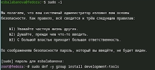
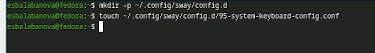
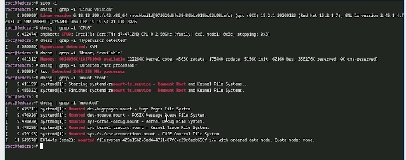

# Цель работы

Целью данной работы является приобретение практических навыков установки операционной системы на виртуальную машину, настройки минимально необходимых для дальнейшей работы сервисов.

# Задание

Установка Linux на VirtualBox. Установка необходимого ПО. Первоначальная настройка ОС для дальнейшей работы.

# Теоретическое введение

Операционная система Linux представляет собой семейство Unix-подобных операционных систем, основанных на одноименном ядре, разработанном Линусом Торвальдсом в 1991 году. Главной особенностью Linux является его открытый исходный код, что означает возможность свободного использования, изучения, изменения и распространения системы. Linux работает по принципу многозадачности и многопользовательского режима, обеспечивая высокую стабильность, безопасность и производительность. На основе ядра Linux создаются дистрибутивы – готовые к использованию операционные системы, включающие ядро, системные утилиты, графическую среду и прикладное программное обеспечение. Fedora – это один из популярных дистрибутивов, разрабатываемый компанией Red Hat и сообществом, отличающийся использованием самых свежих версий программного обеспечения и ориентацией на разработчиков и энтузиастов open-source технологий. Дистрибутив Fedora выпускается каждые шесть месяцев и служит своеобразной тестовой площадкой для новых технологий, которые впоследствии могут войти в коммерческую версию Red Hat Enterprise Linux. Sway (от англ. SirCmpwn's Wayland compositor) – это композитор для Wayland, предназначенный для работы в окружениях с тайловым оконным менеджером i3. Он полностью совместим с конфигурацией i3 и позволяет эффективно управлять окнами без использования мыши, что особенно актуально при работе в терминале и программировании. Работа с Linux и его дистрибутивами, такими как Fedora, а также с оконными менеджерами типа Sway, требует понимания основных принципов организации файловой системы, работы с правами доступа, управления процессами и использования командной строки.

# Выполнение лабораторной работы

1) Установим виртуальную машину в VirtualBox. Создадим учебную запись и запустим установку ([рис. @fig-001]).

{#fig-001 width=70%}

2) Войдем в супер-аккаунт для того, чтобы установить средства разработки ([рис. @fig-002]).

{#fig-002 width=70%}

3) Обновим все пакеты ([рис. @fig-003]).

{#fig-003 width=70%}

4) Займемся повышением комфорта работы. Установим программы для удобства работы в консоли ([рис. @fig-004]).

{#fig-004 width=70%}

5) Установим другой вариант консоли ([рис. @fig-005]).

{#fig-005 width=70%}

6) Подключим автоматическое обновление. Установим необходимое для этого программное обеспечение ([рис. @fig-006]).

{#fig-006 width=70%}

7) Запустим таймер ([рис. @fig-007]).

{#fig-007 width=70%} 

8) В данном курсе работа с SELinux не рассматривается, поэтому отключим её через mc ([рис. @fig-008]).

{#fig-008 width=70%}

9) Займемся настройкой раскладки клавиатуры. Создадим конфигурационный файл ([рис. @fig-009]).

{#fig-009 width=70%}

10) Отредактируем конфигурационный файл  ([рис. @fig-010]).

{#fig-010 width=70%}

11)  Теперь переключимся на роль супер-пользователя и отредактируем другой конфигурационный файл ([рис. @fig-011]).

{#fig-011 width=70%}

12) Переключимся на роль супер-пользователя и установим pandoc и подходящий для него pandoc-crossref и texlive ([рис. @fig-012]).

{#fig-012 width=70%}

13) Выполним домашнее задание. Найдем: версию ядра линукс, частоту процессора, модель процессора, объем доступной оперативной памяти, тип обнаруженного гипервизора, тип файловой системы корневого отдела, последовательность монтирования файловых систем ([рис. @fig-013]).

{#fig-013 width=70%}

# Выводы

В ходе выполнения лабораторный работы я приборела навыки установки виртуальной машины в VirtualBox, установила ряд пакетов и настроила ОС для дальнейшей
работы на ней.

# Список литературы
