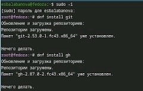
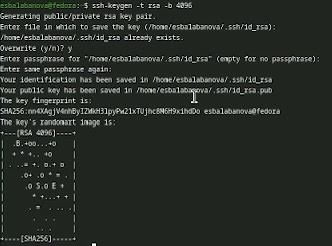
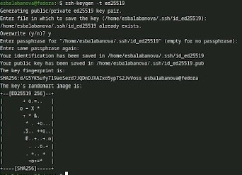
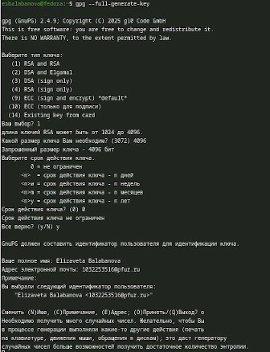
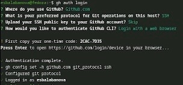
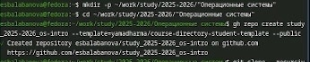

---
## Front matter
lang: ru-RU
title: Отчет по лабораторной работе №2
subtitle: Архитектура компьютера и операционные системы
author:
  - Балабанова Елизавета Сергеевна
institute:
  - Российский университет дружбы народов, Москва, Россия

## i18n babel
babel-lang: russian
babel-otherlangs: english

## Formatting pdf
toc: false
toc-title: Содержание
slide_level: 2
aspectratio: 169
section-titles: true
theme: metropolis
header-includes:
 - \metroset{progressbar=frametitle,sectionpage=progressbar,numbering=fraction}
---

# Информация

## Докладчик

  * Балабанова Елизавета Сергеевна
  * Группа: НКАбд-01-25
  * Студенчский билет: 1032253516
  * Российский университет дружбы народов

## Цели и задачи

Изучить идеологию и применение средств контроля версий. Освоить умения по работе с git.

## Задание

1. Создать базовую конфигурацию для работы с git.
2. Создать ключ SSH.
3. Создать ключ PGP.
4. Настроить подписи git.
5. Создать локальный каталог для выполнения заданий по предмету.

---

##  Теоретическое введение

Системы контроля версий (Version Control System, VCS) применяются при работе нескольких человек над одним проектом. Обычно основное дерево проекта хранится в локальном или удалённом репозитории, к которому настроен доступ для участников проекта. При внесении изменений в содержание проекта система контроля версий позволяет их фиксировать, совмещать изменения, произведённые разными участниками проекта, производить откат к любой более ранней версии проекта, если это требуется.

##  Установка программного обеспечения

Перейдем в режим супер-пользователя для установки программного обеспечения (рис. 1).

{#fig-001 width=70%}

Перейдем к базовой настройке git: зададим имя и email репозитория, настроим utf-8 в выводе сообщений git, зададим имя начальной ветки, параметры autocrlf и safecrlf (рис. 2).

{#fig-002 width=70%}

Перейдем к созданию ключей ssh. Сначала, по алгоритму rsa.(рис. 3).

{#fig-003 width=70%}

##

Затем по алгоритму ed25519 (рис. 4).

{#fig-004 width=70%}

##

Переходим к созданию ключей pgp. Генерируем ключ. (рис. 5).

{#fig-005 width=70%}

##

Настроим автоматические подписи коммитов git. Используя введенный email, укажем git применять его при подписи коммитов (рис. 6).

{#fig-006 width=70%}

##

Настроим gh. Авторизируемся через браузер (рис. 7).

{#fig-007 width=70%}

##

Создадим шаблон для рабочего пространства (рис. 8).

{#fig-008 width=70%}

##

Перейдем в каталог курса, удалим лишние файлы, создадим необходимые каталоги. Наконец, отправим файлы на сервер (рис. 9).

{#fig-009 width=70%}

## Выводы

В результате выполнения данной лабораторной работы я приобрела необходимые навыки работы с гит, научилась созданию репозиториев, gpg и ssh ключей, настроила каталог курса и авторизовалась в gh.
