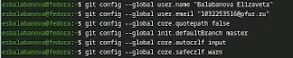
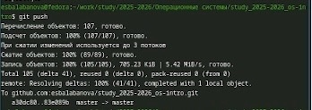

# Цель работы

Целью работы является изучить идеологию и применение средств контроля версий и освоить умения по работе с git.

# Задание

Создать базовую конфигурацию для работы с git. Создать ключ SSH. Создать ключ PGP. Настроить подписи git. Зарегистрироваться на Github. Создать локальный каталог для выполнения заданий по предмету.

# Теоретическое введение

Системы контроля версий (Version Control System, VCS) применяются при работе нескольких человек над одним проектом. Обычно основное дерево проекта хранится в локальном или удалённом репозитории, к которому настроен доступ для участников проекта. При внесении изменений в содержание проекта система контроля версий позволяет их фиксировать, совмещать изменения, произведённые разными участниками проекта, производить откат к любой более ранней версии проекта, если это требуется.
В классических системах контроля версий используется централизованная модель, предполагающая наличие единого репозитория для хранения файлов. Выполнение большинства функций по управлению версиями осуществляется специальным сервером. Участник проекта (пользователь) перед началом работы посредством определённых команд получает нужную ему версию файлов. После внесения изменений, пользователь размещает новую версию в хранилище. При этом предыдущие версии не удаляются из центрального хранилища и к ним можно вернуться в любой момент. Сервер может сохранять не полную версию изменённых файлов, а производить так называемую дельта-компрессию — сохранять только изменения между последовательными версиями, что позволяет уменьшить объём хранимых данных. Система контроля версий Git представляет собой набор программ командной строки. Доступ к ним можно получить из терминала посредством ввода команды git с различными опциями.
Благодаря тому, что Git является распределённой системой контроля версий, резервную копию локального хранилища можно сделать простым копированием или архивацией.

# Выполнение лабораторной работы

1) Перейдем в режим супер-пользователя для установки программного обеспечения ([рис. @fig-001]).

{#fig-001 width=70%}

2) Перейдем к базовой настройке git: зададим имя и email репозитория, настроим utf-8 в выводе сообщений git, зададим имя начальной ветки, параметры autocrlf и safecrlf ([рис. @fig-002]).

{#fig-002 width=70%}

3) Перейдем к созданию ключей ssh. Сначала, по алгоритму rsa.([рис. @fig-003]).

{#fig-003 width=70%}

4) Затем по алгоритму ed25519 ([рис. @fig-004]).

{#fig-004 width=70%}

5) Переходим к созданию ключей pgp. Генерируем ключ. ([рис. @fig-005]).

{#fig-005 width=70%}

6) Настроим автоматические подписи коммитов git. Используя введенный email, укажем git применять его при подписи коммитов ([рис. @fig-006]).

{#fig-006 width=70%}

7) Настроим gh. Авторизируемся через браузер ([рис. @fig-007]).

{#fig-007 width=70%}

8) Создадим шаблон для рабочего пространства ([рис. @fig-008]).

{#fig-008 width=70%}

9) Перейдем в каталог курса, удалим лишние файлы, создадим необходимые каталоги. Наконец, отправим файлы на сервер ([рис. @fig-009]).

{#fig-009 width=70%}

# Выводы

В результате выполнения данной лабораторной работы я приобрела необходимые навыки работы с гит, научилась созданию репозиториев, gpg и ssh ключей, настроила каталог курса и авторизовалась в gh.

# Список литературы
