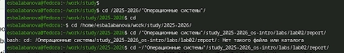
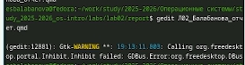
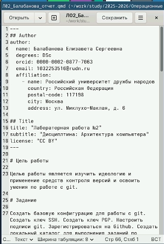
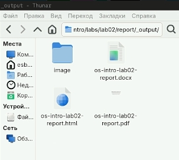

# Цель работы

Цель работы: научиться оформлять отчёты по лабораторным работам с помощью легковесного языка разметки Markdown и освоить преобразование Markdown-файлов в форматы PDF и DOCX с использованием инструмента Pandoc.

# Задание

Сделать отчёт по предыдущей лабораторной работе в формате Markdown. В качестве отчёта просьба предоставить отчёты в 3 форматах: pdf, docx и md (в архиве, поскольку он должен содержать скриншоты, Makefile и т.д.)

# Теоретическое введение

Markdown – это легковесный язык разметки, созданный для оформления текста с минимальными усилиями при сохранении читаемости в исходном виде. Он широко используется для написания документации, README-файлов, сообщений на форумах и, конечно, для оформления отчётов по лабораторным работам. Основные элементы форматирования включают заголовки (создаются знаком #), полужирный текст (текст), курсив (текст), полужирный курсив (текст), блоки цитирования (символ >), маркированные списки (звёздочки или тире), нумерованные списки (цифры с точкой), вложенные списки (с отступами), ссылки (текст), вставку кода (одинарные или тройные обратные кавычки), верхние и нижние индексы (H~2~O и 2^10^), а также математические формулы в формате LaTeX (внутритекстовые $...$ и выключные ... с возможностью подписей и ссылок). Для преобразования файлов из Markdown в другие форматы (PDF, DOCX) используется программа Pandoc с дополнительными фильтрами pandoc-citeproc и pandoc-crossref, что позволяет автоматизировать процесс создания отчётов через Makefile. Структура отчёта по лабораторной работе должна соответствовать ГОСТ 7.32-2001 и включать титульный лист, введение с целями и задачами, основную часть с описанием хода работы и результатами, заключение с выводами, а также при необходимости список использованных источников и приложения со скриншотами.

# Выполнение лабораторной работы

1) Перейдем в нужный каталог для написания отчета с помощью команды cd ([рис. @fig-001]).

{#fig-001 width=70%}

2) Заранее установим команду gedit и с помощью нее откроем файл шаблона отчета ([рис. @fig-002]).

{#fig-002 width=70%}

3) Редактируем шаблон отчета: меняем имя, прописываем цель, задания, теоретическое введение, последовательность выполнения и т.д.  ([рис. @fig-003]).

{#fig-003 width=70%}

4) С помощью команды make компилируем отчёт в форматах pdf и docx, убеждаемся в корректном создании файлов ([рис. @fig-004]).

{#fig-004 width=70%}

# Выводы

В ходе выполнения лабораторной работы были изучены основные элементы языка разметки Markdown, включая заголовки, форматирование текста, списки, ссылки, вставку кода и математических формул. Освоена работа с программой Pandoc для преобразования Markdown-файлов в форматы PDF и DOCX, а также автоматизация этого процесса с помощью Makefile.

# Список литературы
