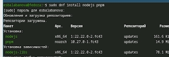
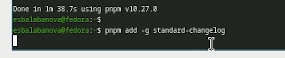
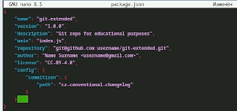
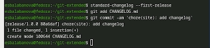
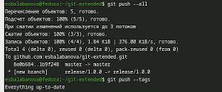
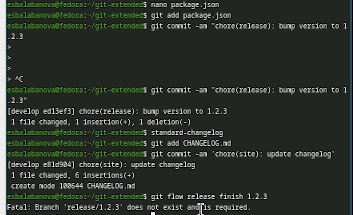

---
## Front matter
lang: ru-RU
title: Отчет по лабораторной работе №4
subtitle: Архитектура компьютера и операционные системы
author:
  - Балабанова Елизавета Сергеевна
institute:
  - Российский университет дружбы народов, Москва, Россия

## i18n babel
babel-lang: russian
babel-otherlangs: english

## Formatting pdf
toc: false
toc-title: Содержание
slide_level: 2
aspectratio: 169
section-titles: true
theme: metropolis
header-includes:
 - \metroset{progressbar=frametitle,sectionpage=progressbar,numbering=fraction}
---

# Информация

## Докладчик

  * Балабанова Елизавета Сергеевна
  * Группа: НКАбд-01-25
  * Студенчский билет: 1032253516
  * Российский университет дружбы народов

## Цели и задачи

Получение навыков правильной работы с репозиториями git.

## Задание

Выполнить работу для тестового репозитория. Преобразовать рабочий репозиторий в репозиторий с git-flow и conventional commits.

---

##  Теоретическое введение

Модель ветвления Gitflow представляет собой строгую модель организации веток в Git, которая отлично подходит для рабочего процесса на основе релизов. В отличие от простой модели с одной веткой master, Gitflow предполагает использование двух основных веток: в ветке master хранится официальная история релизов с присвоенными номерами версий, а ветка develop предназначена для объединения всех новых функций и служит основной веткой разработки. Для удобства работы с этой моделью используется пакет git-flow, который автоматизирует создание и управление ветками. 
Node.js представляет собой среду, которая используется для создания серверных приложений, инструментов командной строки и автоматизации задач. Node.js работает управляет зависимостями через менеджер пакетов npm и имеет огромную экосистему модулей. 

## Установка программного обеспечения  

Установим программное обеспечение. Для начала сделаем это с node.js pnpm (рис. 1).

{#fig-001 width=70%}

##

Установим git-flow (рис. 2).

{#fig-002 width=70%}

##

Настроим Node.js. Добавим каталог с исполняемыми файлами, запустим pnpm и перелогинимся. Сделаем общепринятые коммиты. Сначала commitizen (рис. 3).

{#fig-003 width=70%}

##

Установим changelog (рис. 4).

{#fig-004 width=70%}

##

Создадим удаленный репозиторий на github. Сделаем первый коммит и выложим его на github (рис. 5).

{#fig-005 width=70%}

##

Перейдем к конфигурации общепонятных коммитов. Отредактируем пакет (рис. 6).

{#fig-006 width=70%}

##

Добавим новые файлы, выполним коммит, отправим на github ([рис. 7).

{#fig-007 width=70%}

##

Инициализируем git-flow, убедимся, что мы на ветке develop, загрузим весь репозиторий в хранилище (рис. 8).

{#fig-008 width=70%}

##

Создадим первый релиз с версией 1.0.0. Создадим журнал изменений, добавим его в индекс (рис. 9).

{#fig-009 width=70%}

##

Зальем релизную ветку в основную ветку, отправим данные на github.  (рис. 10).

{#fig-010 width=70%}

##

Создадим релиз с версией 1.2.3. Обновим номер версии в пакете, создадим журнал изменений и добавим его в индекс  (рис. 11).

{#fig-011 width=70%}

##

Зальем релизную ветку в основную, отправим данные на github. Создадим релиз на github с комментарием из журнала изменений (рис. 12).

{#fig-012 width=70%}

## Выводы

В ходе выполнения лабораторный работы я получила навыки правильной работы с репозиториями git.
