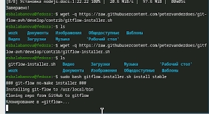
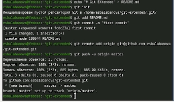
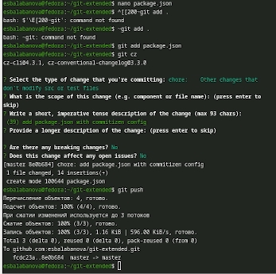
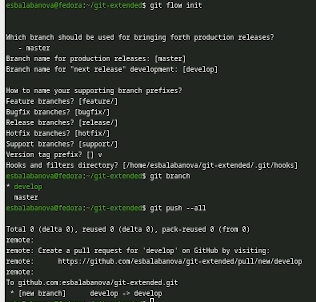
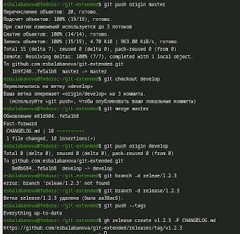

# Цель работы

Целью работы является получение навыков правильной работы с репозиториями git.

# Задание

Выполнить работу для тестового репозитория. Преобразовать рабочий репозиторий в репозиторий с git-flow и conventional commits.

# Теоретическое введение

Модель ветвления Gitflow Workflow, опубликованная и популяризованная Винсентом Дриссеном, представляет собой строгую модель организации веток в Git, которая отлично подходит для рабочего процесса на основе релизов. В отличие от простой модели с одной веткой master, Gitflow предполагает использование двух основных веток: в ветке master хранится официальная история релизов с присвоенными номерами версий, а ветка develop предназначена для объединения всех новых функций и служит основной веткой разработки. Для удобства работы с этой моделью используется пакет git-flow, который автоматизирует создание и управление ветками. Последовательность действий при работе по модели Gitflow выглядит следующим образом: из ветки master создаётся ветка develop, из ветки develop создаются ветки feature для разработки новых функций и ветка release для подготовки релиза, а из ветки master создаются ветки hotfix для срочного исправления ошибок в рабочей среде. Когда работа над веткой feature завершена, она сливается с веткой develop; когда работа над веткой release завершена, она сливается с ветками develop и master; когда работа над веткой hotfix завершена, она также сливается в ветки develop и master. Такая организация позволяет параллельно вести разработку новых функций, готовить релизы и оперативно исправлять критичные ошибки, не нарушая стабильность основного кода. Node.js представляет собой среду выполнения JavaScript, построенную на движке V8, которая позволяет запускать JavaScript-код вне браузера и используется для создания серверных приложений, инструментов командной строки и автоматизации задач. Node.js работает асинхронно, управляет зависимостями через менеджер пакетов npm и имеет огромную экосистему модулей. В лабораторной работе Node.js будет применяться для написания скриптов автоматизации работы с Git, генерации отчётов и взаимодействия с репозиторием, что позволит на практике реализовать Gitflow Workflow и закрепить понимание принципов организации совместной разработки программного обеспечения.

# Выполнение лабораторной работы

1) Установим программное обеспечение. Для начала сделаем это с node.js pnpm ([рис. @fig-001]).

{#fig-001 width=70%}

2) Установим git-flow ([рис. @fig-002]).

{#fig-002 width=70%}

3) Настроим Node.js. Добавим каталог с исполняемыми файлами, запустим pnpm и перелогинимся. Сделаем общепринятые коммиты. Сначала commitizen ([рис. @fig-003]).

{#fig-003 width=70%}

4) Установим changelog ([рис. @fig-004]).

{#fig-004 width=70%}

5) Создадим удаленный репозиторий на github. Сделаем первый коммит и выложим его на github ([рис. @fig-005]).

{#fig-005 width=70%}

6) Перейдем к конфигурации общепонятных коммитов. Отредактируем пакет ([рис. @fig-006]).

{#fig-006 width=70%}

7) Добавим новые файлы, выполним коммит, отправим на github ([рис. @fig-007]).

{#fig-007 width=70%}

8) Инициализируем git-flow, убедимся, что мы на ветке develop, загрузим весь репозиторий в хранилище ([рис. @fig-008]).

{#fig-008 width=70%}

9) Создадим первый релиз с версией 1.0.0. Создадим журнал изменений, добавим его в индекс ([рис. @fig-009]).

{#fig-009 width=70%}

10) Зальем релизную ветку в основную ветку, отправим данные на github.  ([рис. @fig-010]).

{#fig-010 width=70%}

11) Создадим релиз с версией 1.2.3. Обновим номер версии в пакете, создадим журнал изменений и добавим его в индекс  ([рис. @fig-011]).

{#fig-011 width=70%}

12) Зальем релизную ветку в основную, отправим данные на github. Создадим релиз на github с комментарием из журнала изменений ([рис. @fig-012]).

{#fig-012 width=70%}

# Выводы

В ходе выполнения лабораторный работы я получила навыки правильной работы с репозиториями git.

# Список литературы
