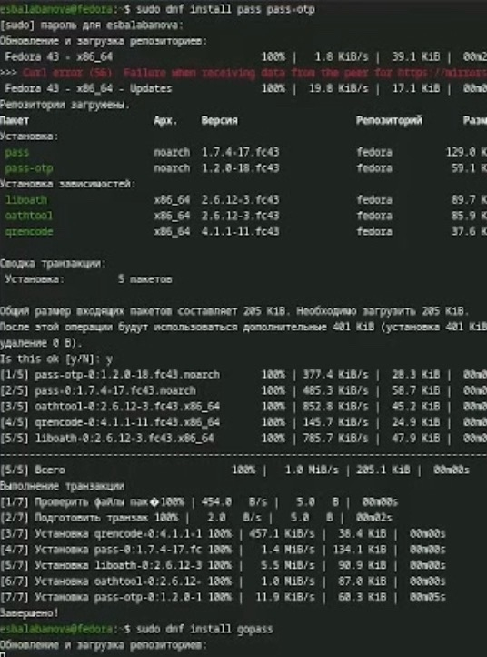
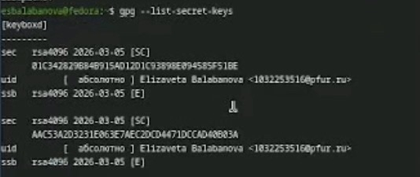
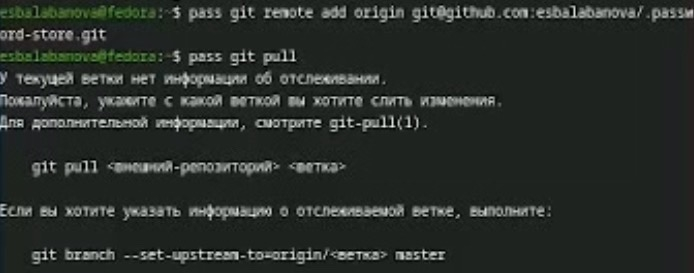
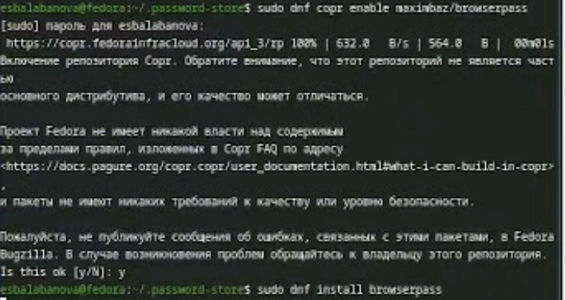
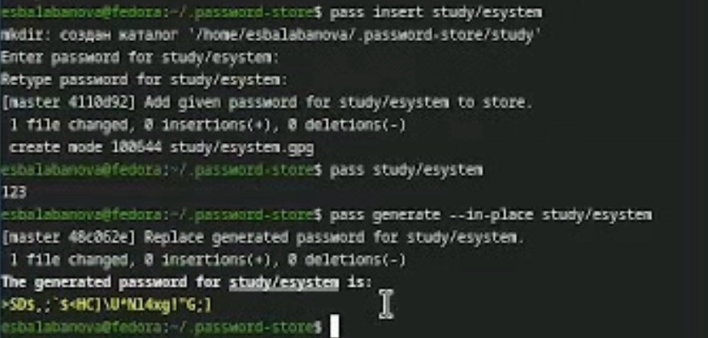
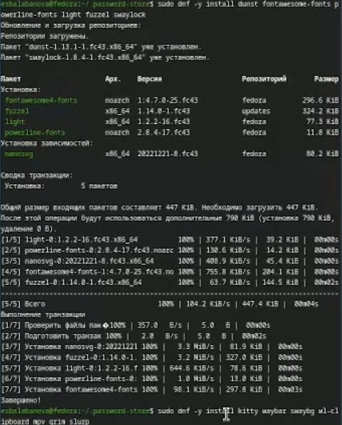
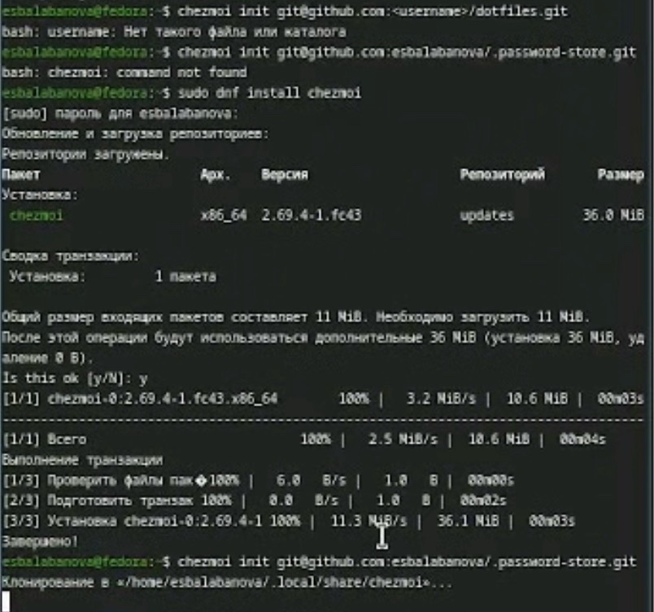

---
## Front matter
lang: ru-RU
title: Отчет по лабораторной работе №5
subtitle: Архитектура компьютера и операционные системы
author:
  - Балабанова Елизавета Сергеевна
institute:
  - Российский университет дружбы народов, Москва, Россия

## i18n babel
babel-lang: russian
babel-otherlangs: english

## Formatting pdf
toc: false
toc-title: Содержание
slide_level: 2
aspectratio: 169
section-titles: true
theme: metropolis
header-includes:
 - \metroset{progressbar=frametitle,sectionpage=progressbar,numbering=fraction}
---

# Информация

## Докладчик

  * Балабанова Елизавета Сергеевна
  * Группа: НКАбд-01-25
  * Студенчский билет: 1032253516
  * Российский университет дружбы народов

## Цели и задачи

Познакомиться с pass, gopass, native messaging, chezmoi. Научиться пользоваться этими утилитами, синхронизировать их с гит.

## Задание

1. Установить дополнительное ПО
2. Установить и настроить pass
3. Настроить интерфейс с браузером
4. Сохранить пароль
5. Установить и настроить chezmoi
6. Настроить chezmoi на новой машине
7. Выполнить ежедневные операции с chezmoi

---

## Теоретическое введение 

Менеджер паролей pass — программа, сделанная в рамках идеологии Unix. Также носит название стандартного менеджера паролей для Unix (The standard Unix password manager).
Основные свойства: Данные хранятся в файловой системе в виде каталогов и файлов, Файлы шифруются с помощью GPG-ключа.
Структура базы может быть произвольной, если Вы собираетесь использовать её напрямую, без промежуточного программного обеспечения. Тогда семантику структуры базы данных Вы держите в своей голове.
Если же необходимо использовать дополнительное программное обеспечение, необходимо семантику заложить в структуру базы паролей.
chezmoi используется для управления файлами конфигурации домашнего каталога пользователя. 

# Выполнение лабораторной работы

Установим pass и gopass (рис. 1).

{#fig-001 width=70%}

##

Посмотрим список ключей (рис. 2).

{#fig-002 width=70%}

##

Инициализируем хранилище и создадим структуру git (рис. 3).

{#fig-003 width=70%}

##

Зададим адрес репозитория на хостинге и синхронизируем (рис. 4).

{#fig-004 width=70%}

##

Вручную закоммитим и выложим изменения (рис. 5).

{#fig-005 width=70%}

##

Установим необходимое программное обеспечение (рис. 6).

{#fig-006 width=70%}

##

Добавим новый пароль, отобразим пароль для указанного имени файла и заменим существующий пароль (рис. 7).

{#fig-007 width=70%} 

##

Установим дополнительное программное обеспечение (рис. 8).

{#fig-008 width=70%}

##

Установим шрифты (рис. 9).

{#fig-009 width=70%}

##

Установим бинарный файл (рис. 10).

{#fig-010 width=70%}

##

Инициализируем chezmoi с моим репозиторием (рис. 11).

{#fig-011 width=70%}

##

На второй машине инициализируем chezmoi с моим репозиторием (рис. 12).

{#fig-012 width=70%}

##

Проверим какие изменения внесет chezmoi и применим последние изменения из моего репозитория (рис. 13).

{#fig-013 width=70%}

##

Через mc откроем необходимый файл и приведем его к такому виду (рис. 13).

{#fig-013 width=70%}

## Выводы

Мы познакомились с pass, gopass, native messaging, chezmoi. Научились пользоваться этими утилитами, синхронизировали их с гит. свое
