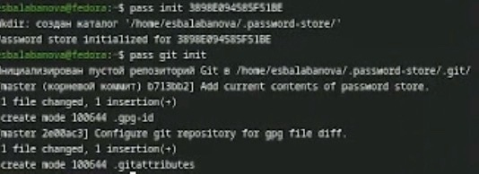
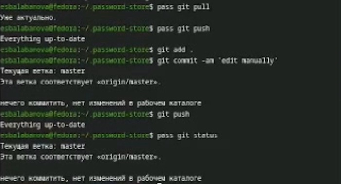
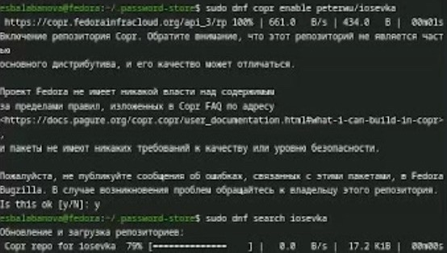
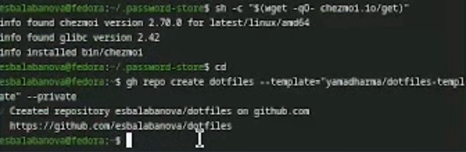
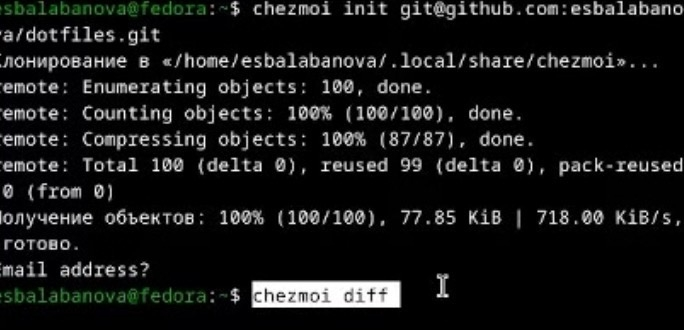
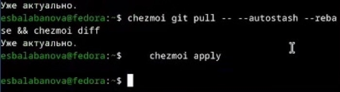
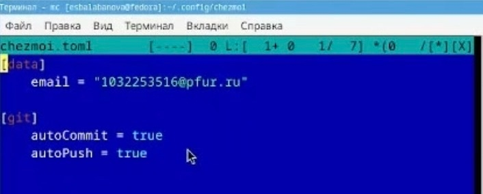

# Цель работы

Познакомиться с pass, gopass, native messaging, chezmoi. Научиться пользоваться этими утилитами, синхронизировать их с гит.

# Задание

1. Установить дополнительное ПО
2. Установить и настроить pass
3. Настроить интерфейс с браузером
4. Сохранить пароль
5. Установить и настроить chezmoi
6. Настроить chezmoi на новой машине
7. Выполнить ежедневные операции с chezmoi

# Теоретическое введение

Менеджер паролей pass — программа, сделанная в рамках идеологии Unix. Также носит название стандартного менеджера паролей для Unix (The standard Unix password manager).
Основные свойства: Данные хранятся в файловой системе в виде каталогов и файлов, Файлы шифруются с помощью GPG-ключа.
Структура базы может быть произвольной, если Вы собираетесь использовать её напрямую, без промежуточного программного обеспечения. Тогда семантику структуры базы данных Вы держите в своей голове.
Если же необходимо использовать дополнительное программное обеспечение, необходимо семантику заложить в структуру базы паролей.
chezmoi используется для управления файлами конфигурации домашнего каталога пользователя.

# Выполнение лабораторной работы

Установим pass и gopass ([рис. @fig-001]).

{#fig-001 width=70%}

Посмотрим список ключей ([рис. @fig-002]).

{#fig-002 width=70%}

Инициализируем хранилище и создадим структуру git ([рис. @fig-003]).

{#fig-003 width=70%}

Зададим адрес репозитория на хостинге и синхронизируем ([рис. @fig-004]).

{#fig-004 width=70%}

Вручную закоммитим и выложим изменения ([рис. @fig-005]).

{#fig-005 width=70%}

Установим необходимое программное обеспечение ([рис. @fig-006]).

{#fig-006 width=70%}

Добавим новый пароль, отобразим пароль для указанного имени файла и заменим существующий пароль ([рис. @fig-007]).

{#fig-007 width=70%}

Установим дополнительное программное обеспечение  ([рис. @fig-008]).

{#fig-008 width=70%}

Установим шрифты ([рис. @fig-009]).

{#fig-009 width=70%}

Установим бинарный файл ([рис. @fig-010]).

{#fig-010 width=70%}

Инициализируем chezmoi с моим репозиторием  ([рис. @fig-011]).

{#fig-011 width=70%}

На второй машине инициализируем chezmoi с моим репозиторием ([рис. @fig-012]).

{#fig-012 width=70%}

Проверим какие изменения внесет chezmoi и применим последние изменения из моего репозитория  ([рис. @fig-013]).

{#fig-013 width=70%}

Через mc откроем необходимый файл и приведем его к такому виду ([рис. @fig-014]).

{#fig-014 width=70%}

# Выводы

В ходе выполнения лабораторный работы я получила навыки правильной работы с репозиториями git.

# Список литературы
