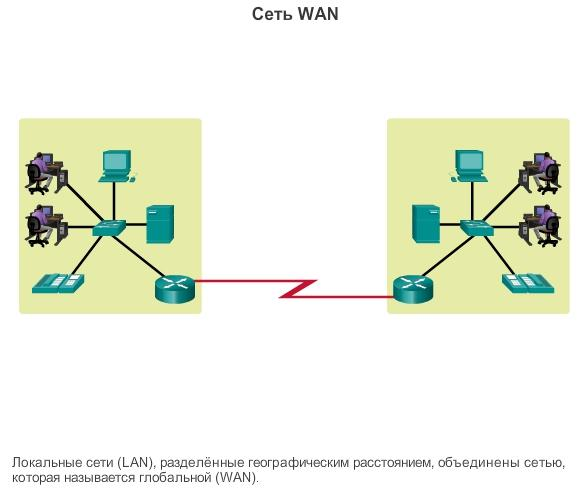
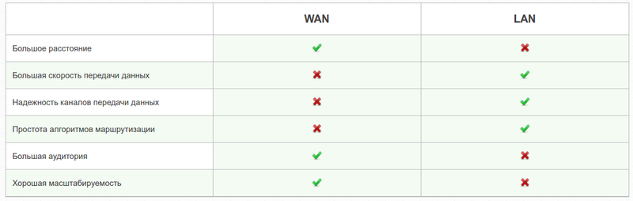
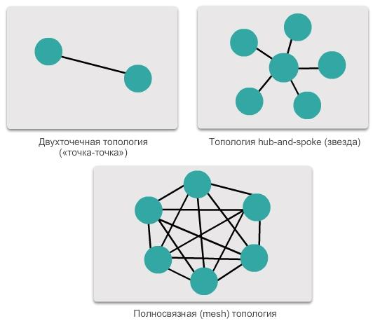
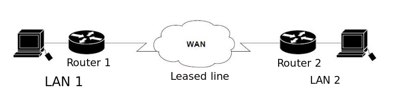

# Вступление

Глобальные вычислительные сети являются важнейшим элементом современной информационной инфраструктуры, обеспечивающим связь между компьютерами и локальными сетями на огромных расстояниях. Понимание принципов их архитектурной организации необходимо для изучения дисциплины «Архитектура компьютера и операционные системы», поскольку именно на уровне глобальных сетей решаются задачи масштабируемости, отказоустойчивости и эффективного управления трафиком. В настоящем докладе рассматриваются ключевые аспекты построения WAN: от базовых определений и иерархических моделей до конкретных технологий коммутации и протоколов передачи данных.

# Что такое глобальная сеть (WAN)

Глобальная сеть (WAN), от англ. Wide Area Network — это сеть, которая соединяет компьютеры и устройства на больших географических расстояниях, часто охватывая города, страны или даже континенты. WAN используется для передачи данных между локальными сетями (LAN) и может включать в себя различные технологии и типы соединений.

Основные характеристики WAN:

- Широкий охват: WAN объединяет устройства, расположенные на значительном расстоянии друг от друга, что позволяет соединять организации, филиалы и пользователей по всему миру.
- Разнообразие технологий: WAN может использовать различные технологии передачи данных, такие как оптоволокно, спутниковая связь, DSL, кабельные соединения и беспроводные технологии.
- Высокая скорость передачи: Скорость передачи данных в WAN может варьироваться, но современные технологии обеспечивают достаточно высокую скорость для эффективного обмена данными.
- Маршрутизация: Для управления трафиком в WAN используются маршрутизаторы, которые направляют данные по наиболее эффективным маршрутам ([рис. @fig-001]).

{#fig-001 width=70%}

# Особенности WAN, отличия от LAN

Глобальные сети отличаются от локальных тем, что глобальные сети рассчитаны на неограниченное число абонентов на большой географической территории.

Основные отличия WAN от LAN:

- Связывает компьютеры, рассредоточенные на большом расстоянии — сотен и тысяч километров.
- Протяженность, качество и способ прокладки линий связи: в глобальных сетях часто применяются уже существующие линии связи (телеграфные или телефонные), а в локальных сетях они прокладываются заново.
- Более низкие, чем в локальных сетях, скорости передачи данных (десятки килобит в секунду для старых каналов), которые как следствие ограничивают набор услуг передачей файлов.
- В условиях низкой надежности физических каналов в глобальных сетях требуются более сложные методы передачи данных и более сложное оборудование.
- В отличие от локальных сетей, WAN рассчитаны на работу с некачественными каналами связи, где намного более важно не качество связи, а сам факт её существования.
- Масштабируемость: локальные сети плохо масштабируются из-за привязанности к топологии, глобальные же масштабируются хорошо, так как изначально разрабатывались в расчете на работу с произвольными топологиями([рис. @fig-002]).

{#fig-002 width=70%}

# Иерархическая архитектура глобальных сетей

Иерархическое проектирование сети — это подход к сетевой архитектуре для создания надежных, масштабируемых и эффективных компьютерных сетевых систем. Методология проектирования обеспечивает лучшее управление, производительность и безопасность за счет разделения сети на различные уровни, каждый из которых имеет определенные функции и обязанности.

В традиционных конструкциях плоских сетей сети соединяются с помощью концентраторов и коммутаторов, которыми становится сложно управлять и обслуживать по мере их масштабирования. Внедрение иерархической структуры сети решает эти проблемы путем разделения сети на различные уровни для лучшего управления трафиком, сокращения времени отклика и оптимизации производительности сети.

Иерархическая структура сети обычно состоит из следующих основных уровней:

1. Уровень доступа: Это точка входа для пользовательских устройств (например, компьютеров, сотовых телефонов, принтеров и так далее) для доступа к сети. Уровень доступа отвечает за предоставление доступа пользователей, аутентификацию, политики безопасности и другие функции, а также выполняет локальную обработку трафика. Коммутаторы играют ключевую роль на этом уровне, подключая пользовательские устройства к сети.

2. Уровень распределения: Уровень распределения расположен между уровнем доступа и базовым уровнем и отвечает за соединение различных подсетей уровня доступа. На уровне распределения трафик агрегируется и фильтруется, а также разделяется между секторами с помощью технологии виртуальной локальной сети или VLAN.

3. Основной уровень: Уровень ядра является основой сети и отвечает за высокоскоростную передачу данных и обмен трафиком. Он соединяет различные уровни агрегации и обеспечивает высокую доступность и резервирование сети. Базовый уровень должен характеризоваться высокой пропускной способностью, низкой задержкой и высокой доступностью.

# Топологии глобальных сетей

Глобальные сети часто подключены с помощью следующих физических топологий.

- Двухточечная топология («точка-точка»): это простейшая топология, которая представляет собой постоянное соединение между двумя конечными устройствами. Именно по этой причине данная топология наиболее распространена в глобальной сети.

- Топология hub-and-spoke (звезда): версия топологии типа «звезда» для глобальной сети, в которой центральный узел подключает филиалы с помощью двухточечных соединений.

- Полносвязная (mesh) топология: эта топология предоставляет высокую доступность, но требует, чтобы каждая конечная система была связана с каждой другой системой. Поэтому административные и физические расходы могут быть весьма значительными. Каждый канал является двухточечным каналом для другого узла. Варианты этой топологии включают в себя частично-связную (partial mesh) топологию, к которой подключены некоторые, но не все оконечные устройства ([рис. @fig-003]).

{#fig-003 width=70%}

# Технологии передачи данных

Глобальные сети необходимы для предоставления информации и своих сервисов огромному количеству абонентов, которые находятся в пределах большой территории. Такими абонентами являются как отдельные компьютеры, так и локальные сети. У каждой глобальной сети есть оператор и поставщик услуг.

Услуги, предоставляемые глобальной сетью, заключаются в передаче пакетов локальной сети и компьютеров, трафика и многого другого.

Для передачи информации в глобальных сетях используются определенные виды коммутации. Одной из самых распространенных считается глобальная сеть интернет, которая способна объединять огромное количество сетей и отдельных компьютеров для обеспечения обмена информацией по каналам общественных телекоммуникаций.

В процессе пользования интернетом происходит обмен информацией между серверами с помощью высокоскоростных каналов и магистралей.

К магистралям относятся:

- телефонные линии;
- цифровые линии;
- оптические каналы связи;
- радиоканалы;
- спутниковые линии связи.

За счет этого все услуги интернета работают по принципу клиент-сервер.

# Коммутации в глобальных сетях

В глобальных сетях существует три принципиально различные схемы коммутации:

- коммутация каналов;
- коммутация сообщений;
- коммутация пакетов.

Коммутация каналов в глобальных сетях — процесс, который по запросу осуществляет соединение двух или более станций данных и обеспечивает монопольное использование канала передачи данных до тех пор, пока не произойдет разъединение. Коммутация каналов подразумевает образование непрерывного составного физического канала из последовательно соединенных отдельных канальных участков для прямой передачи данных между узлами. Отдельные каналы соединяются между собой специальной аппаратурой — коммутаторами, которые могут устанавливать связи между любыми конечными узлами сети.

Коммутация сообщений в глобальных сетях — процесс пересылки данных, включающий прием, хранение, выбор исходного направления и дальнейшую передачу сообщений без нарушения их целостности. Используются в тех случаях, когда не ожидается немедленной реакции на сообщение. Сообщения передаются между транзитными компьютерами сети с временной буферизацией их на дисках каждого компьютера. Сообщениями называются данные, объединенные смысловым содержанием, имеющие определенную структуру и пригодные для обработки, пересылки или использования.

Источниками сообщений могут быть голос, изображения, текст, данные. Для передачи звука традиционно используется телефон, изображений — телевидение, текста — телеграф (телетайп), данных — вычислительные сети. Установление соединения между отправителем и получателем с возможностью обмена сообщениями без заметных временных задержек характеризует режим работы online. При существенных задержках с запоминанием информации в промежуточных узлах имеем режим offline.

Коммутация пакетов в глобальных сетях — это коммутация сообщений, представляемых в виде адресуемых пакетов, когда канал передачи данных занят только во время передачи пакета и по ее завершению освобождается для передачи других пакетов. Коммутаторы сети, в роли которых выступают шлюзы и маршрутизаторы, принимают пакеты от конечных узлов и на основании адресной информации передают их друг другу, а в конечном итоге станции назначения.

# Принципы построения WAN

Многие глобальные сети построены для конкретной организации и являются закрытыми. Другие, построенные интернет-провайдерами, предоставляют соединение из локальной сети организации в интернет. WAN довольно часто построены с использованием выделенных линий (закрытых двунаправленных линий между двумя или более локациями, предоставляемых за определенную месячную плату). На каждом конце выделенной линии роутер соединяет локальную сеть на его стороне со вторым роутером, имеющим собственную локальную сеть. Однако выделенные линии могут быть очень дорогими. Поэтому вместо них WAN также могут быть построены c использованием менее дорогой схемы передачи пакетов.

Основными используемыми протоколами в глобальных сетях являются TCP/IP, SONET/SDH, MPLS, ATM и Frame relay. Ранее был также широко распространён протокол X.25, который может по праву считаться прародителем Frame relay ([рис. @fig-004]).

{#fig-004 width=70%}

# Сетевая модель OSI и стек протоколов TCP/IP в WAN

Протокол передачи данных — набор соглашений интерфейса логического уровня, которые определяют обмен данными между различными программами. Эти соглашения задают единообразный способ передачи сообщений и обработки ошибок при взаимодействии программного обеспечения разнесённой в пространстве аппаратуры, соединённой тем или иным интерфейсом.

Транспортный уровень отвечает за установление временного сеанса связи и передачу данных между двумя приложениями.

Транспортный протокол — протокол управления передачей (TCP): управляет отдельными сеансами связи между серверами и клиентами в Интернете. TCP делит сообщения HTTP на более мелкие части, называемые сегментами. Эти сегменты передаются между веб-сервером и клиентскими процессами, запущенными на узле назначения. TCP также отвечает за управление размером и скоростью, с которой происходит обмен сообщениями между сервером и клиентом.

Как уже упоминалось ранее, TCP считается надёжным транспортным протоколом, а это значит, что он использует процессы, которые обеспечивают надёжную передачу данных между приложениями с помощью подтверждения доставки. Передача с использованием TCP аналогична отправке пакетов, которые отслеживаются от источника к получателю.

Международная организация по стандартизации (ISO) создала модель, называемую взаимодействием открытых систем (OSI), которая позволяет связываться между собой разнообразным системам. Модель OSI с семью уровнями обеспечивает рекомендации для развития универсально совместимых протоколов организации сети.

Физический, канальный и сетевой уровни — это уровни поддержки сети. Сеансовый, представительский и прикладной уровни — пользовательские уровни поддержки. Транспортный уровень связывает уровни поддержки сети и пользовательские уровни поддержки.

Физический уровень координирует функции, для того чтобы передать битовый поток по физической среде. Канальный уровень предназначен для того, чтобы доставлять модули данных от одной станции до следующей без ошибок. Сетевой уровень отвечает за доставку «источник — пункт назначения» пакета через множество сетевых линий связи. Транспортный уровень отвечает за доставку «источник — пункт назначения» полного сообщения. Сеансовый уровень устанавливает, обслуживает и синхронизирует взаимодействие между средствами связи. Уровень представления гарантирует способность к взаимодействию между средствами связи с помощью преобразования данных во взаимно согласованные форматы.

# Заключение

Глобальные вычислительные сети объединяют устройства и локальные сети на огромных расстояниях, обеспечивая функционирование интернета и корпоративных коммуникаций. Иерархическая архитектура, включающая уровни доступа, распределения и ядра, позволяет строить масштабируемые и отказоустойчивые системы. Различные физические топологии определяют баланс между надёжностью соединений и стоимостью инфраструктуры. Технологии коммутации пакетов, каналов и сообщений лежат в основе передачи данных, а протоколы TCP/IP и модель OSI обеспечивают совместимость оборудования разных производителей. Отличия WAN от LAN проявляются в протяжённости линий связи, методах маршрутизации и требованиях к надёжности. Современные тенденции развития глобальных сетей направлены на увеличение пропускной способности оптоволоконных магистралей и внедрение программно-определяемых технологий управления трафиком.

# Список литературы

1)https://serverspace.ru/support/glossary/globalnaya-set-wan/?utm_source=google.com&utm_medium=organic&utm_campaign=google.com&utm_referrer=google.com
2)https://ru.wikipedia.org/wiki/%D0%93%D0%BB%D0%BE%D0%B1%D0%B0%D0%BB%D1%8C%D0%BD%D0%B0%D1%8F_%D0%B2%D1%8B%D1%87%D0%B8%D1%81%D0%BB%D0%B8%D1%82%D0%B5%D0%BB%D1%8C%D0%BD%D0%B0%D1%8F_%D1%81%D0%B5%D1%82%D1%8C
3)https://www.fibermall.com/ru/blog/core-distribution-and-assess-layer.htm?srsltid=AfmBOopTryUuqqUzUBnszwQCoXaxTDmYtkpj8EVP6rXEZWx3elg97NIb
4)https://studfile.net/preview/3569305/page:43/
5)https://www.sviaz-expo.ru/ru/ui/17132/
6)https://neerc.ifmo.ru/wiki/index.php?title=WAN_-_%D0%BE%D1%81%D0%BE%D0%B1%D0%B5%D0%BD%D0%BD%D0%BE%D1%81%D1%82%D0%B8,_%D0%BF%D1%80%D0%B8%D0%BD%D1%86%D0%B8%D0%BF%D1%8B_%D0%BF%D0%BE%D1%81%D1%82%D1%80%D0%BE%D0%B5%D0%BD%D0%B8%D1%8F_%D1%81%D0%B5%D1%82%D0%B5%D0%B9
