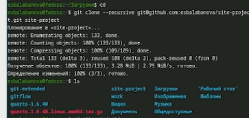
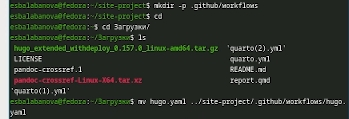

---
## Front matter
lang: ru-RU
title: Индивидуальный проект 1 этап
subtitle: Архитектура компьютера и операционные системы
author: Балабанова Елизавета Сергеевна 
institute: Российский университет дружбы народов, Москва, Россия

## i18n babel
babel-lang: russian
babel-otherlangs: english

## Formatting pdf
toc: false
toc-title: Содержание
slide_level: 2
aspectratio: 169
section-titles: true
theme: metropolis
header-includes:
 - \metroset{progressbar=frametitle,sectionpage=progressbar,numbering=fraction}
---

# Информация

## Докладчик

  * Балабанова Елизавета Сергеевна
  * Группа: НКАбд-01-25
  * Студенческий билет: 1032253516
  * Российский университет дружбы народов

## Цель работы

Научиться размещать сайт на Github pages. Выполнить первый этап индивидуального проекта.

## Задание

1. Установка необходимого ПО
2. Скачивание шаблона темы сайта
3. Размещение его на хостинге Git
4. Установка параметра для URL сайта
5. Размещение загатовки сайта на Github pages

## Выполнение индивидуального проекта

Заранее установим hugo с офийиального сайта Github на свою операционную систему, создам общую папку между ней и виртуальной машиной, скопирую в папку "Загрузки". Зайду через терминал в этот каталог и разархивирую скачанный архив hugo (рис. 1).

{#fig:001 width=70%}

##

Перемещу сам hugo в каталог /usr/local/bin. Проверю, что он там появился (рис. 2).

{#fig:002 width=70%}

##

Захожу в свой аккаунт на Github, создаю свой репозиторий для будущего сайта, используя шаблон (рис. 3).

{#fig:003 width=70%}

##

Клонирую репозиторий на свою машину (рис. 4). 

{#fig:004 width=70%}

##

Загружаю туда конфигурационный файл для сайта (рис. 5).

{#fig:005 width=70%}

##

Делаю снимок изменений, создаю коммит и отпрвляю изменения на Github (рис. 6).

{#fig:006 width=70%}

##

В настройках репозитория на Github указываю "github actions", проверяю работоспособность сайта (рис. 7).

{#fig:007  width=70%}

## Выводы
Я научилась размещать сайт на Github pages, выполнила первый этап индивидуального проекта.
