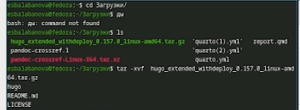
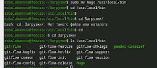
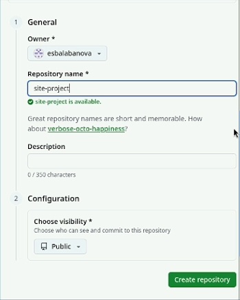
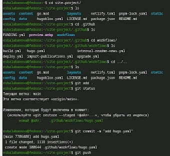
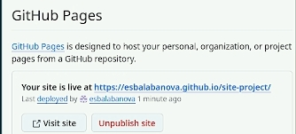

# Цель работы

Научиться размещать сайт на Github pages. Выполнить первый этап индивидуального проекта.

# Задание

1. Установка необходимого ПО
2. Скачивание шаблона темы сайта
3. Размещение его на хостинге Git
4. Установка параметра для URL сайта
5. Размещение загатовки сайта на Github pages

# Выполнение индивидуального проекта

1) Заранее установим hugo с офийиального сайта Github на свою операционную систему, создам общую папку между ней и виртуальной машиной, скопирую в папку "Загрузки". Зайду через терминал в этот каталог и разархивирую скачанный архив hugo ([рис. @fig-001]).

{#fig-001 width=70%}

2) Перемещу сам hugo в каталог /usr/local/bin. Проверю, что он там появился ([рис. @fig-002]).

{#fig-002 width=70%}

3) Захожу в свой аккаунт на Github, создаю свой репозиторий для будущего сайта, используя шаблон ([рис. @fig-003]).

{#fig-003 width=70%}

4) Клонирую репозиторий на свою машину ([рис. @fig-004]).

{#fig-004 width=70%}

5) Загружаю туда конфигурационный файл для сайта ([рис. @fig-005]).

{#fig-005 width=70%}

6) Делаю снимок изменений, создаю коммит и отпрвляю изменения на Github ([рис. @fig-006]).

{#fig-006 width=70%}

7) В настройках репозитория на Github указываю "github actions", проверяю работоспособность сайта ([рис. @fig-007]).

{#fig-007 width=70%}

# Выводы

Я научилась размещать сайт на Github pages, выполнила первый этап индивидуального проекта.

# Список литературы
